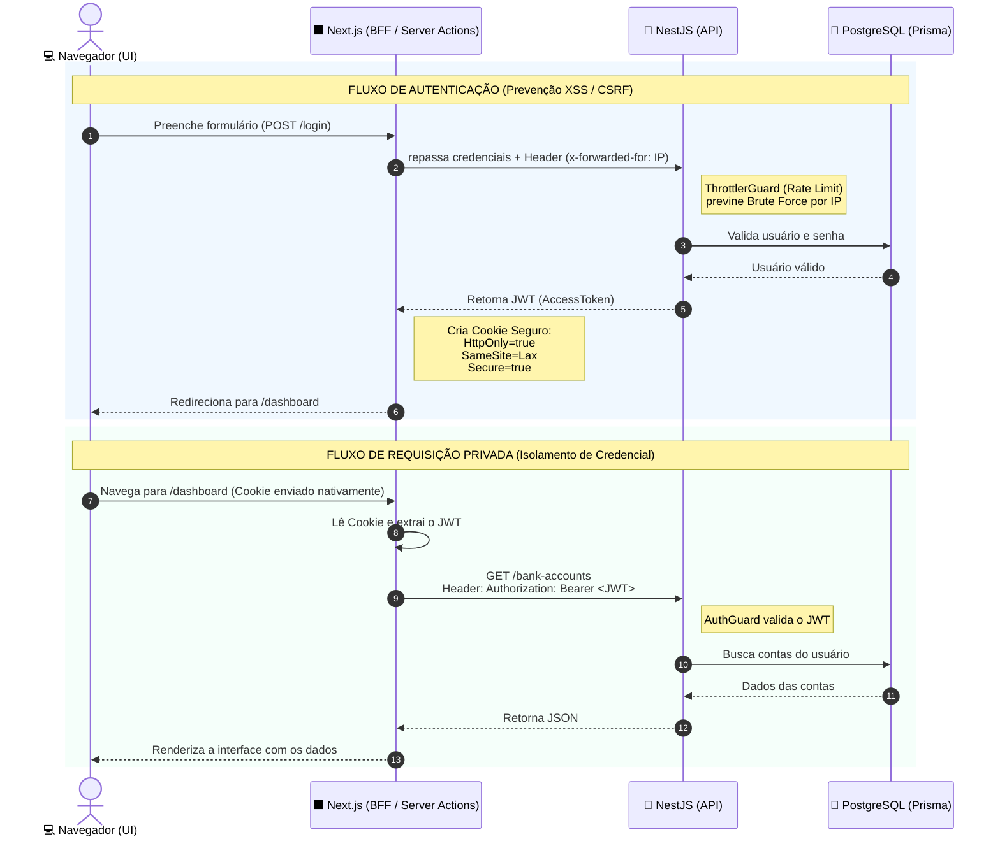

# 💰 psa.finance - Gestão Financeira Pessoal


Uma aplicação Fullstack desenvolvida para o Desafio Técnico da vaga de Desenvolvedor Pleno. O sistema permite o gerenciamento completo de finanças pessoais, incluindo gestão de múltiplas contas bancárias, categorização e histórico de movimentações.

🌐 **Links de Produção:**
- **Frontend (UI):** [https://desafio-dev-psa.vercel.app/](https://desafio-dev-psa.vercel.app/)
- **Documentação da API:** [https://desafio-dev-production.up.railway.app/docs](https://desafio-dev-production.up.railway.app/docs)

---

## ✅ Cobertura do Desafio

O projeto atende a **100% dos requisitos obrigatórios** e implementa **todos os diferenciais** sugeridos no escopo do teste:

- [x] **Autenticação:** Login e Cadastro com JWT seguro.
- [x] **Relacionamentos:** Movimentações e contas associadas exclusivamente ao usuário autenticado.
- [x] **Persistência e ORM:** Utilização do Prisma ORM (v7) + PostgreSQL com Migrations automatizadas.
- [x] **Documentação:** API totalmente documentada via Swagger/Scalar OpenAPI.
- [x] 🌟 **Diferencial - Testes Automatizados:** Cobertura de testes na API utilizando *In-Memory Repositories*.
- [x] 🌟 **Diferencial - Arquitetura Escalável:** Padrões Repository, Dependency Injection (DI) e separação de camadas rígida (`auth`, `users`, `bank-accounts`, `categories`, `transactions`).
- [x] 🌟 **Diferencial - Tratamento de Erros:** Validações robustas com `class-validator` e padronização de respostas de erro na API e UI.
- [x] 🌟 **Diferencial - Responsividade:** Frontend *mobile-first* estilizado com Tailwind CSS.
- [x] 🌟 **Diferencial - Deploy:** Aplicação 100% online (Vercel + Railway).

---

## 📸 Demonstração e Arquitetura

### Interface da Aplicação

*Painel principal exibindo as transações (responsivo para Desktop e Mobile).*

### Arquitetura de Segurança (BFF)
O diagrama abaixo ilustra a proteção contra **XSS** e **CSRF** utilizando *Server Actions* para gerenciamento de Cookies `HttpOnly`, e **Rate Limit** na API NestJS baseada no IP real do cliente.



---

## ⚙️ Como executar o projeto localmente

A infraestrutura foi desenhada para a melhor Experiência de Desenvolvimento (DX) possível. Você não precisa instalar Node.js ou configurar bancos de dados na sua máquina.

### Pré-requisitos
- **Docker** e **Docker Compose** instalados (ou Podman).

### 🚀 Passo a Passo

1. Clone o repositório:
```bash
git clone https://github.com/lucianogmoraesjr/desafio-dev.git
cd desafio-dev

```

2. Suba os containers em modo *detached*:

```bash
docker compose up -d --build

```

> 💡 **Nota:** Ao executar o comando acima, o banco de dados sobe, as **Migrations rodam automaticamente**, e um script de **Seed popula o banco** (utilizando Faker) com categorias, contas e 50 transações realistas.

3. 🌐 **Acesse a aplicação:**
* **Interface Web:** [http://localhost:3000](http://localhost:3000)
* **Documentação da API:** [http://localhost:3001/docs](http://localhost:3001/docs)


---

## 🧪 Dados para Teste (Seeding)

Para facilitar o teste local, utilize a conta gerada automaticamente pelo *Seed* e já populada com dados ricos:

* **E-mail:** `john@mail.com`
* **Senha:** `forte123`

---

## 📖 Como rodar os Testes Automatizados

A API possui testes automatizados focados na camada de serviços (Regras de Negócio). Para executá-los localmente, acesse a pasta da API e utilize os comandos:

```bash
# Entre na pasta da API
cd api

# Instale as dependências locais
npm install

# Rode os testes unitários
npm run test

```

---

## 🏛️ Decisões Técnicas e Boas Práticas

Além do que foi solicitado, adicionei camadas extras de qualidade focadas em cenários reais de produção:

1. **Backend for Frontend (BFF) & Segurança:** O frontend (Next.js) atua como um intermediário seguro. O token JWT fica isolado em cookies `HttpOnly`, `Secure` e `SameSite=Lax` no lado do servidor via Next.js Server Actions. Isso blinda a aplicação completamente contra ataques **XSS** e **CSRF**.
2. **Rate Limiting e Proxy Trust:** O NestJS está configurado com `@nestjs/throttler` (ThrottlerGuard). Como usamos um BFF, a API foi configurada para confiar no proxy e extrair o cabeçalho `x-forwarded-for`, bloqueando tentativas de força bruta baseadas no IP real do cliente, e não no IP do servidor Next.js.
3. **In-Memory Repositories:** Desacoplamento do Prisma ORM das regras de negócio através de repositórios baseados em contratos (interfaces). Isso permitiu a criação de bancos de dados em memória para rodar testes ultrarrápidos sem depender de I/O de banco de dados real.
4. **Infraestrutura Automatizada:** Configuração `docker-compose` inteligente utilizando *Multi-stage builds*. O ambiente local retém o *hot-reload* veloz, enquanto as imagens de produção mantêm o footprint enxuto, sem dependências de desenvolvimento.

---

## 👨‍💻 Desenvolvido por

**Luciano Guimarães Moraes Junior**

* [LinkedIn](https://linkedin.com/in/lucianogmoraesjr)
* [GitHub](https://github.com/lucianogmoraesjr)
